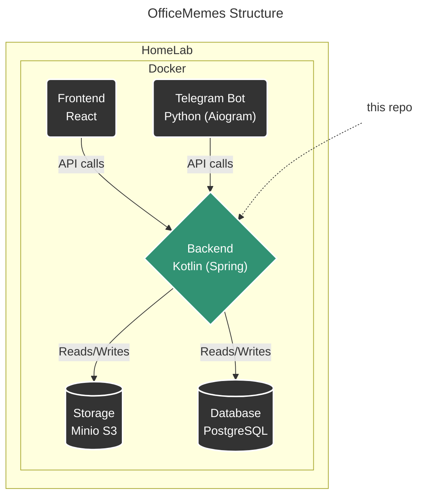

# OfficeMemes Backend

## Project Structure

```mermaid
---
title: OfficeMemes Structure
---
graph TD
    subgraph System["HomeLab"]
        subgraph Container["Docker"]
            frontend("Frontend\nReact")
            backend{"Backend\nKotlin (Spring)"}
            telegram_bot("Telegram Bot\nPython (Aiogram)")
            storage[("Storage\nMinio S3")]
            database[("Database\nPostgreSQL")]

            frontend -->|API calls| backend
            telegram_bot -->|API calls| backend
            backend -->|Reads/Writes| storage
            backend -->|Reads/Writes| database
        end
    end

    %% Добавление пояснения "Вы здесь" для конкретного контейнера (например, для frontend)
    note{{"this repo"}} -.-> backend

    %% Стилизация
    style frontend fill:#333,stroke:#fff,stroke-width:2px,color:#fff
    style telegram_bot fill:#333,stroke:#fff,stroke-width:2px,color:#fff
    style backend fill:#319273,stroke:#fff,stroke-width:2px,color:#fff
    style storage fill:#333,stroke:#fff,stroke-width:2px,color:#fff
    style database fill:#333,stroke:#fff,stroke-width:2px,color:#fff
    style note fill:transparent,stroke:transparent
```
